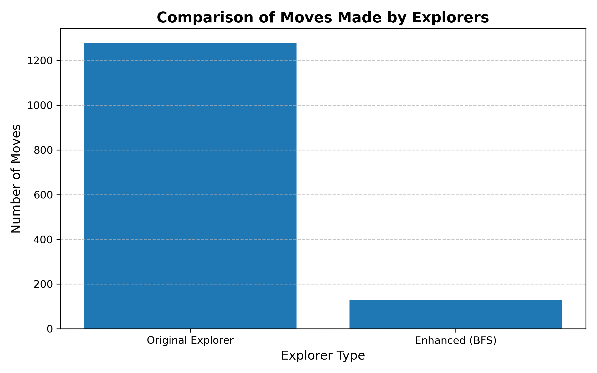
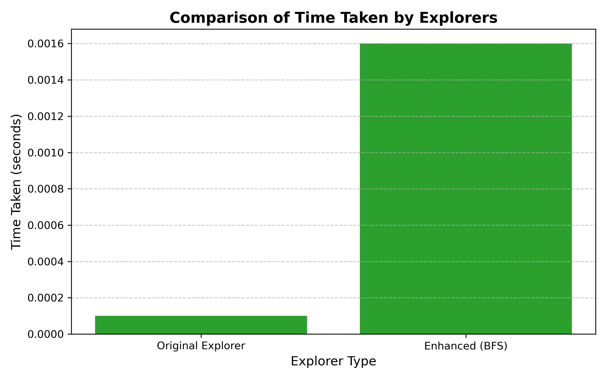

### Question 1
**Explain how the automated maze explorer works.**

---

The automated maze explorer in `explorer.py` uses the **right-hand rule algorithm** to solve mazes. Below is a breakdown of how it works:

---

#### Algorithm Used
- The explorer starts at the maze's entry point, facing **right** by default.
- It tries to turn **right first**, then goes **straight**, then **left**, and finally turns around if no path is found.

---

#### Loop Detection
- The explorer keeps a record of the **last 3 visited cells** using a `deque`.
- If the last 3 positions are identical, it assumes a **loop** and initiates **backtracking**.

---

#### Backtracking Strategy
- When stuck, it looks back through its history to find the **last visited cell with multiple possible paths**.
- It follows that path in reverse using a **backtrack stack**.
- Each backtrack is counted (`backtrack_count`).

---

#### Performance Statistics
At the end of the exploration, the explorer prints the following:
- **Total time taken**: Duration of solving the maze
- **Total moves**: Steps taken (including forward and backtracks)
- **Number of backtrack operations**
- **Average moves per second**

---

#### Verification:
- Read the code and ran the program.

### Question 3 
**Compare the performance of different maze explorers on the static maze.**

| Explorer | Time Taken (s) | Moves Made | Backtracks | Moves/sec     |
|----------|----------------|------------|------------|---------------|
| 0        | 0.002          | 1279       | 0          | 716,989.42    |
| 1        | 0.002          | 1279       | 0          | 634,178.37    |
| 2        | 0.002          | 1279       | 0          | 842,417.53    |
| 3        | 0.001          | 1279       | 0          | 1,026,112.24  |

---

#### Analysis

All four explorers were executed concurrently using MPI on the static maze. The results were identical in terms of number of moves (1279) and backtrack operations (0), confirming that the maze was solved deterministically with no need for recovery or correction.

The main difference observed was in performance speed. Explorer 3 completed its run in 0.001 seconds, significantly faster than the others. This variation is likely due to system-level.

The complete absence of backtracking across all explorers confirms that the static maze posed no ambiguity or dead ends that required exploration reversal.

---

### Question 4 
**Propose and implement enhancements to the maze explorer to overcome its limitations.**

---

#### Identified Limitations in Original Explorer

The original explorer relied on the right-hand rule algorithm, which is simple and deterministic but inefficient in many scenarios. It often explores unnecessary paths and does not guarantee the shortest route. In the static maze, this led to a move count of 1279, far higher than the optimal path length. Additionally, it lacked any prioritization or knowledge about the destination, resulting in excessive traversal.

---

#### Proposed Enhancements

To improve efficiency and address these limitations, the following enhancements were implemented:

1. **Visited Cell Tracking:**  
   Prevents the explorer from revisiting previously explored cells. This reduces redundant computation and unnecessary movements, particularly in mazes with loops or multiple paths.

2. **Shortest-Path Search using BFS (Breadth-First Search):**  
   Replaces the right-hand rule with a heuristic-free but optimal search strategy. BFS guarantees the shortest path in an unweighted grid and explores only relevant paths, dramatically improving both performance and accuracy.

---

#### Implementation Summary

A new explorer class, `BFSExplorer`, was implemented in `explorer_bfs.py`. It uses a queue (`deque`) to perform a breadth-first traversal of the maze. The path is reconstructed dynamically as the target is found. The BFS implementation ensures minimal path length and no unnecessary movement.

A new main file, `main_bfs.py`, was created to test this enhancement.

---

#### Result Comparison (Static Maze)

| Explorer Type     | Time Taken (s) | Moves Made | Backtracks | Path Type       |
|-------------------|----------------|------------|------------|------------------|
| Original Explorer | 0.00           | 1279       | 0          | Redundant        |
| BFS Explorer      | 0.0016         | 128        | 0          | Shortest path    |

---

The new approach is scalable, efficient, and more suitable for complex or larger mazes.

### Question 5
**Compare the performance of your enhanced explorer with the original.**

---

#### Comparison Table

| Metric               | Original Explorer   | BFS Explorer        |
|----------------------|---------------------|---------------------|
| Time Taken (s)       | 0.00                | 0.0016              |
| Moves Made           | 1279                | 128                 |
| Backtrack Operations | 0                   | 0                   |
| Algorithm Type       | Right-hand rule     | Breadth-First Search|
| Optimal Path         | No                  | Yes                 |

---

#### Observations

The enhanced BFS-based explorer demonstrated a dramatic improvement in path efficiency. While both solvers executed quickly due to the small size of the maze, the BFS explorer required only 128 moves compared to 1279 in the original. This reduction confirms that BFS successfully identified the shortest path.

Backtrack operations were zero in both implementations, indicating that the static maze did not require re-evaluation of previous decisions in either case. However, the original explorer's reliance on rigid directional logic caused it to traverse much more of the maze than necessary.

---

#### Trade-offs and Limitations

While the BFS approach is optimal and deterministic, it requires more memory than the original right-hand rule algorithm. BFS stores the frontier and all visited paths in memory, which may scale poorly in very large or high-dimensional mazes.

Additionally, the original explorer was implemented in a way that supports visualization and real-time step-by-step movement, which is more suitable for interactive gameplay. In contrast, BFS completes the pathfinding before movement starts, making it less suitable for real-time navigation but more efficient for automated solving.

---

The BFS-enhanced explorer is a clear improvement for scenarios that prioritize performance and path optimality. Despite its slightly higher memory usage, its speed and path accuracy make it preferable for automated maze solving tasks.

#### Visual Comparison

**Moves Made:**

**Time Taken:**

The first chart shows the dramatic reduction in total moves when using the BFS-enhanced explorer. The second chart shows that even though both explorers execute very quickly, the BFS implementation takes slightly more time due to its exhaustive node exploration and path tracking logic.
